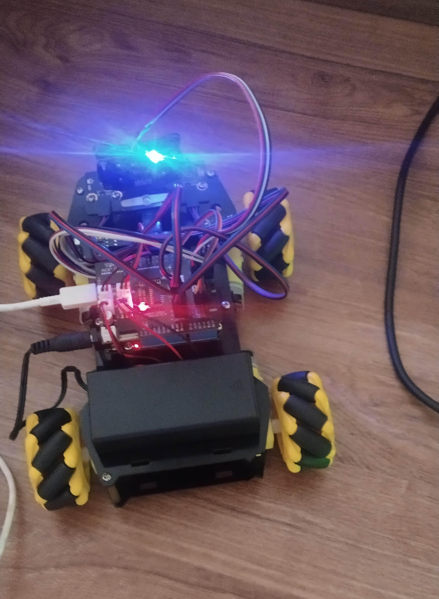

# Smart Robot Car QD001

Minimal project notes for an ACEBOTT QD001 smart robot car experiment. The car is controlled by an ESP32 running Arduino code, while a Python agent on the laptop sends movement commands over USB serial.

## Preview



<video src="https://github.com/user-attachments/assets/0b2938e6-2da8-40fb-8623-330a47298a2c" controls width="500"></video>


## Overview

I assembled the robot car from separated parts using the ACEBOTT tutorial, then tested each major component individually: LED lights, mecanum wheels, servo motor, IR sensor, ultrasonic sensor, and buzzer.

After the basic hardware tests, I moved from ACECode to the Arduino IDE because it worked better on my Linux setup and uploaded sketches much faster. The current project explores a simple AI-control idea: instead of asking the AI to react continuously to the real environment, the agent plans in a small virtual grid first, validates the path, and then sends the full command sequence to the car.

The current demo is crude but shows the concept: the laptop runs the agent, GPT plans the movement, Python sends serial commands, and the ESP32 executes them.

## Files

- `smartcar-agent-control.ino` - Arduino sketch for the ESP32.
- `agent.py` - AI agent and car integration using OpenAI + PySerial.
- `main.py` - earlier/manual control script for sending commands.
- `smartcar-img.jpg` - image of the assembled car.
- `smartcar-agent-demo-small.mp4` - demo video, drawing a simple square.
- `Smart Car Starter Kit for ESP32V1.0.pdf` - assembly/tutorial PDF.
- `Acebott.zip`, `ESP32Servo.zip`, `IRremote.zip` - Arduino libraries/framework files used during setup.

## Hardware Notes

The laptop USB connection could power the ESP32 controller, but not the wheel motors. The batteries could power the motors, but not reliably power the ESP32. The working setup was:

- laptop USB powers the ESP32 and provides serial communication
- battery pack powers the motors
- movement range is limited by the USB cable length

## Setup

1. Install the Arduino IDE.
2. Install the required Arduino libraries from the zip files in this repo.
3. Upload `smartcar-agent-control.ino` to the ESP32.
4. Install the Python dependencies:

```bash
uv sync
```

5. Set your OpenAI API key in a `.env` file:

```bash
OPENAI_API_KEY=your_api_key_here
```

6. Update the serial port in `agent.py` if needed:

```python
PORT = "/dev/ttyUSB0"
```

## Running

Place the car at the bottom-left of the mapped area, facing north, then run:

```bash
uv run python agent.py
```

The ESP32 accepts these serial commands:

- `F` - move forward
- `B` - move backward
- `ML` - move left
- `MR` - move right
- `CW` - rotate clockwise
- `CCW` - rotate counter-clockwise
- `PD` - pen down
- `PU` - pen up
- `S` - stop

`agent.py` also uses higher-level turn commands like `TR` and `TL` in the virtual plan before converting them into repeated rotation commands.

## Current Status

This is a proof-of-concept project, not a precise autonomous robot. The movement is approximate, depends on direction and speed, and the AI works best when planning inside the manually mapped perimeter.
